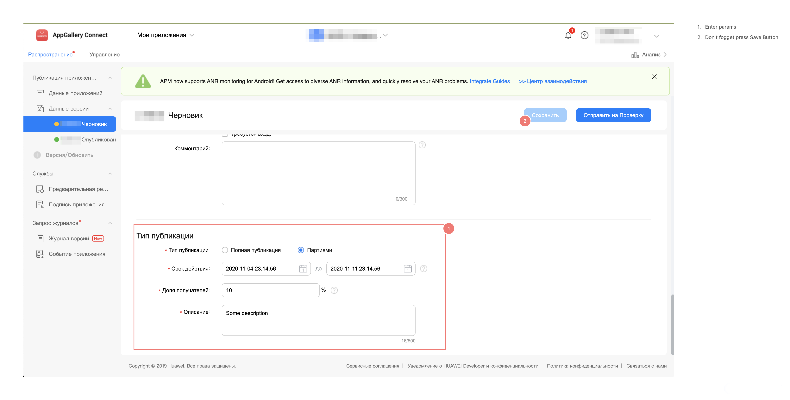

[comment]: # (Markdown formating https://docs.github.com/ru/get-started/writing-on-github/getting-started-with-writing-and-formatting-on-github/basic-writing-and-formatting-syntax)

# Huawei App Gallery Publishing

[](https://search.maven.org/search?q=a:huawei-publish-gradle-plugin)


[](http://www.apache.org/licenses/LICENSE-2.0.html)

The plugin allows to publish the android release build files (`*.apk` and `*.aab`) to the Huawei AppGallery.
For publication the plugin used official [Huawei Publish API (v2)](https://developer.huawei.com/consumer/en/doc/development/AppGallery-connect-References/agcapi-appid-list_v2)

# Table of contents
<!-- TOC -->
- [Features](#features)
- [Support versions](#support-versions)
- [Adding the plugin to your project](#adding-the-plugin-to-your-project)
    - [Using the Gradle plugin DSL](#using-the-gradle-plugin-dsl)
    - [Using the `apply` method](#using-the-apply-method)
    - [Configuring Plugin](#configuring-plugin)
    - [Plugin params](#plugin-params)
- [Plugin usage](#plugin-usage)
- [Known Huawei Publishing API Issues](#known-huawei-publishing-api-issues)
- [FAQ](#faq)
<!-- /TOC -->

# Features

The following features are available:

- [x] :white_check_mark: Publish APK or AAB build file in Huawei AppGallery
- [x] :white_check_mark: Submit the build on all users after getting store approve
- [x] :white_check_mark: Publish the build on a part of users (Release Phases)
- [x] :white_check_mark: Update Release Notes for publishing build (Release Notes)
- [x] :white_check_mark: Update App Basic Info for publishing build
- [x] :white_check_mark: Separated settings for different configurations build types and flavors
- [x] :white_check_mark: Support of Gradle Portal and Gradle DSL
- [x] :white_check_mark: Support of Gradle 7.+
- [x] :white_check_mark: Support of Configuration Cache
- [ ] :children_crossing: Change App Store Information: description, app icon, screenshots and etc.

The following features doesn't support Huawei Publishing API:

- [ ] :no_entry: Update appname, title and description.  
- [ ] :no_entry: Rollout Holding

# Compatibility
The Android Gradle Plugin often changes the Variant API,
so a different version of AGP corresponds to a specific version of the current plugin

| AGP   | Plugin |
|-------|--------|
| 4.0.+ | 1.2.3  |
| 4.1.+ | 1.2.4  |
| 4.2.+ | 1.2.6  |
| 7.+   | 1.3.7  |
| 8.+   | latest |

# Adding the plugin to your project

in application module `./app/build.gradle`

## Using the Gradle plugin DSL

```
plugins {
    id("com.android.application")
    id("ru.cian.huawei-publish-gradle-plugin")
}
```

<details>
<summary>Snapshot builds are also available</summary>
___

You'll need to add the Sonatype snapshots repository.
Look for the actual version of the snapshot in the name of the opened `snapshot-<VERSION>` repository branch.

in `./settings.gradle`

```kotlin
pluginManagement {

    resolutionStrategy {
        eachPlugin {
            if(requested.id.namespace == "ru.cian") {
                useModule("ru.cian:huawei-publish-gradle-plugin:<SNAPSHOT-VERSION>")
            }
        }
    }

    plugins {
        id("ru.cian.huawei-publish-gradle-plugin") version huaweiPublish apply false
    }

    repositories {
        maven { url 'https://oss.sonatype.org/content/repositories/snapshots' }
    }
}
```
___
</details>

## Using the `apply` method

```
buildscript {
    repositories {
        mavenCentral() // or gradlePluginPortal()
    }

    dependencies {
        classpath "ru.cian:huawei-publish-gradle-plugin:<VERSION>"
    }
}

apply plugin: 'com.android.application'
apply plugin: 'ru.cian.huawei-publish-gradle-plugin'
```
<details>
<summary>Snapshot builds are also available</summary>
___

You'll need to add the Sonatype snapshots repository.
Look for the actual version of the snapshot in the name of the opened `snapshot-<VERSION>` repository branch.

```kotlin
buildscript {
    repositories {
        maven { url 'https://oss.sonatype.org/content/repositories/snapshots' }
    }

    dependencies {
        classpath "ru.cian:huawei-publish-gradle-plugin:<VERSION>-SNAPSHOT"
    }
}

apply plugin: 'com.android.application'
apply plugin: 'ru.cian.huawei-publish-gradle-plugin'
```
___

</details>

## Configuring Plugin

<details open>
<summary>Kotlin</summary>

```kotlin
huaweiPublish {
  instances {
      create("release") {
          credentialsPath = "$rootDir/huawei-credentials-release.json"
          deployType = ru.cian.huawei.publish.DeployType.PUBLISH
          buildFormat = ru.cian.huawei.publish.BuildFormat.APK
          releasePhase = ru.cian.huawei.publish.ReleasePhaseExtension(
              startTime = "2025-01-18T21:00:00+0300",
              endTime = "2025-01-21T06:00:00+0300",
              percent = 1.0
          )
          releaseNotes = ru.cian.huawei.publish.ReleaseNotesExtension(
              descriptions = listOf(
                  ru.cian.huawei.publish.ReleaseNote(
                          lang = "ru-RU",
                          filePath = "$projectDir/release-notes-ru.txt"
                  ),
                  ru.cian.huawei.publish.ReleaseNote(
                          lang = "en-US",
                          filePath = "$projectDir/release-notes-en.txt"
                  )
              ),
              removeHtmlTags = false
          )
          appBasicInfo = "$projectDir/app-basic-info.json"
          ...
      }
      create("debug") {
          ...
      }
  }
}
```
</details>

<details>
<summary>Groovy</summary>

```groovy
huaweiPublish {
  instances {
      release {
          credentialsPath = "$rootDir/huawei-credentials-release.json"
          deployType = "publish"
          buildFormat = "apk"
          publishTimeoutMs = 15_000
          publishPeriodMs = 3_000
          releaseTime = "2025-10-21T06:00:00+0300"
          releasePhase = new ru.cian.huawei.publish.ReleasePhaseExtension(
              "2021-10-18T21:00:00+0300",
              "2025-10-21T06:00:00+0300",
              1.0
          )
          releaseNotes = new ru.cian.huawei.publish.ReleaseNotesExtension(
              [
                new ru.cian.huawei.publish.ReleaseNote(
                    "ru-RU",
                    "$projectDir/release-notes-ru.txt"
                ),
                new ru.cian.huawei.publish.ReleaseNote(
                    "en-EN",
                    "$projectDir/release-notes-en.txt"
                ),
              ],
              false
          )
          appBasicInfo = "$projectDir/app-basic-info.json"
          ...
      }
      debug {
          ...
      }
  }
}
```
</details>

Plugin supports different settings for different buildType and flavors.
For example, for `demo` and `full` flavors and `release` buildType just change instances like that:
```kotlin
huaweiPublish {
    instances {
        demoRelease {
            credentialsPath = "$rootDir/huawei-credentials-demo-release.json"
            buildFormat = "apk"
            ...
        }
        fullRelease {
            credentialsPath = "$rootDir/huawei-credentials-full-release.json"
            buildFormat = "apk"
            ...
        }
    }
}
```

File `huawei-credentials.json` contains next json structure:
```json
  {
    "client_id": "<CLIENT_ID>",
    "client_secret": "<CLIENT_SECRET>"
  }
```
How to get credentials see [AppGallery Connect API Getting Started](https://developer.huawei.com/consumer/en/doc/development/AppGallery-connect-Guides/agcapi-getstarted).

## Plugin params
Where Priority(P), Required(R), Optional(O)

| param              | P | type         | default value | cli                            | description                                                                                                                                                                                   |
|--------------------|---|--------------|---------------|--------------------------------|-----------------------------------------------------------------------------------------------------------------------------------------------------------------------------------------------|
| `credentialsPath`  | O | string       | null          | `--credentialsPath`            | Path to json file with AppGallery credentials params (`client_id` and `client_secret`)                                                                                                        |
| `deployType`       | O | string       | "publish"     | `--deployType`                 | '`publish`' to deploy and submit build on users,<br>'`draft`' to deploy and save as draft without submit on users,<br>'`upload-only`' to deploy without draft saving and submit on users      |
| `publishTimeoutMs` | O | long         | 600000 #(10m) | `--publishTimeoutMs`           | The time in millis during which the plugin periodically tries to publish the build                                                                                                            |
| `publishPeriodMs`  | O | long         | 15000  #(15s) | `--publishPeriodMs`            | The period in millis between tries to publish the build                                                                                                                                       |
| `buildFormat`      | O | string       | "apk"         | `--buildFormat`                | 'apk' or 'aab' for corresponding build format                                                                                                                                                 |
| `buildFile`        | O | string       | null          | `--buildFile`                  | Path to build file. "null" means use standard path for "apk" and "aab" files.                                                                                                                 |
| `releaseTime`      | O | string       | null          | `--releaseTime`                | Release time after review in UTC format. The format is 'yyyy-MM-dd'T'HH:mm:ssZZ'.                                                                                                             |
| `releasePhase`     | O | ReleasePhase | null          | (see ReleasePhase param desc.) | Release Phase settings. For mote info see documentation below.                                                                                                                                |
| `releaseNotes`     | O | ReleaseNotes | null          | (see ReleaseNotes param desc.) | Release Notes settings. For mote info see documentation below.                                                                                                                                |
| `appBasicInfo`     | O | string       | null          | `--appBasicInfo`               | Path to json file with params to update app basic info [api](https://developer.huawei.com/consumer/en/doc/development/AppGallery-connect-References/agcapi-app-info-update-0000001111685198)) |

other params

| ReleasePhase(Object) | P | type    | default value | cli                       | description                                                                                                |
|----------------------|---|---------|---------------|---------------------------|------------------------------------------------------------------------------------------------------------|
| `startTime`          | R | string  | null          | `--releasePhaseStartTime` | Start release time after review in UTC format. The format is 'yyyy-MM-dd'T'HH:mm:ssZZ'.                    |
| `endTime`            | R | string  | null          | `--releasePhaseEndTime`   | End release time after review in UTC format. The format is 'yyyy-MM-dd'T'HH:mm:ssZZ'.                      |
| `percent`            | R | string  | null          | `--releasePhasePercent`   | Percentage of target users of release by phase. The integer or decimal value from 0 to 100.                |

| ReleaseNotes(Object) | P | type              | default value | cli                            | description                                                                                                                                 |
|----------------------|---|-------------------|---------------|--------------------------------|---------------------------------------------------------------------------------------------------------------------------------------------|
| `descriptions`       | R | List<ReleaseNote> | null          | (See `--releaseNotes` desc.)   | Release Notes by languages. For mote info see documentation below.                                                                          |
| `removeHtmlTags`     | O | boolean           | false         | (See `--removeHtmlTags` desc.) | :warning: EXPERIMENTAL: True - if needs to remove html tags from provided release notes. For example, to support Google Play release notes. |

| ReleaseNote(Object)  | P | type    | default value | cli                          | description                                                                                                                                  |
|----------------------|---|---------|---------------|------------------------------|----------------------------------------------------------------------------------------------------------------------------------------------|
| `lang`               | R | string  | null          | (See `--releaseNotes` desc.) | [Langtype](https://developer.huawei.com/consumer/en/doc/development/AppGallery-connect-References/agcapi-reference-langtype-0000001158245079)|
| `filePath`           | R | string  | null          | (See `--releaseNotes` desc.) | Absolutely path to file with Release Notes for current `lang`. Release notes text must be less or equals to 500 sign.                        |

For CLI `--releaseNotes` use string type with format: `<lang_1>:<releaseNotes_FilePath_1>;<lang_2>:<releaseNotes_FilePath_2>`. 

<details>
<summary>For example</summary>

```bash
--releaseNotes="en_EN:/home/<USERNAME>/str/project/release_notes_en.txt;ru_RU:/home/<USERNAME>/str/project/release_notes_ru.txt"
```

</details>

# Plugin usage

Gradle generate `publishHuaweiAppGallery<*>` task for all buildType and flavor configurations
```groovy
android {
    buildTypes {
        release {
            ...
        }
        debug {
            ...
        }
    }
}
```

**Note!** Before uploading build file you should build it. Be careful. Don't publish old build file. 
 
```bash
./gradlew assembleRelease publishHuaweiAppGalleryRelease
```

or 

```bash
./gradlew bundleRelease publishHuaweiAppGalleryRelease
```

You can apply or override each plugin extension parameter dynamically by using CLI params. For example:

```bash
./gradlew assembleRelease publishHuaweiAppGalleryRelease \
    --deployType=publish \
    --credentialsPath="/sample1/huawei-credentials.json" \
    --buildFormat=apk
```

<details>
<summary>Example  uploading build file without publishing</summary>

You can upload the build file as draft without submit on users.

From gradle build script:
```groovy
huaweiPublish {
    instances {
        release {
            credentialsPath = "$rootDir/sample1/huawei-credentials.json"
            deployType = "draft"
        }
    }
}
```

or execute from command line:

```bash
./gradlew assembleRelease publishHuaweiAppGalleryRelease \
    --credentialsPath="$rootDir/sample1/huawei-credentials.json" \
    --deployType=draft
```

</details>

<details>
<summary>Example publishing AppBundle</summary>

If you choose AppBundle see [Application Signature](https://developer.huawei.com/consumer/en/service/josp/agc/index.html#/myApp/101338815/9249519184596012000) before using the plugin.

From gradle build script:
```groovy
huaweiPublish {
    instances {
        release {
            credentialsPath = "$rootDir/sample1/huawei-credentials.json"
            buildFormat = "aab"
        }
    }
}
```
or execute from command line:

```bash
./gradlew assembleRelease publishHuaweiAppGalleryRelease \
    --credentialsPath="$rootDir/sample1/huawei-credentials.json" \
    --buildFormat=aab
```

After uploading build file the Huawei Service will start processed. It may take 2-5 minutes, depending on the size of the software package.
While publishing the AppBundle build file you can get the error:
>What went wrong:
> Execution failed for task ':app:publishHuaweiAppGalleryRelease'.
> Ret(msg=[cds]submit failed, additional msg is [The file is being processed.
> It may take 2-5 minutes, depending on the size of the software package.])

When publishing an AppBundle the service takes some time to parse the file.
In this case, the plugin uses a special mechanism for the full cycle.
By default, the plugin tries to publish the assembly every 15 seconds for 10 minutes.
To change values see using parameters: `publishTimeoutMs` and `publishPeriodMs`.

For more information see the [Issue#7](https://github.com/cianru/huawei-publish-gradle-plugin/issues/7)
and [Issue#38](https://github.com/cianru/huawei-publish-gradle-plugin/issues/38).

</details>

<details>
<summary>Example publishing with release phase</summary>

You can upload the build file and submit it on the part of users.

From gradle build script:
```kotlin
huaweiPublish {
    instances {
        release {
            credentialsPath = "$rootDir/sample1/huawei-credentials.json"
            releasePhase {
                startTime = "2020-11-13T08:01:02+0300"
                endTime = "2020-11-20T15:30:00+0300"
                percent = 10.0
            }
        }
    }
}
```

or execute from command line:

```bash
./gradlew assembleRelease publishHuaweiAppGalleryRelease \
    --clientId=<CLIENT_ID> \
    --clientSecret=<CLIENT_SECRET> \
    --releasePhaseStartTime=2020-11-13T08:01:02+0300 \
    --releasePhaseEndTime=2020-11-20T15:30:00+0300 \
    --releasePhasePercent=10.0
```

While publishing with release phase you can get the error:
>Execution failed for task ':app:publishHuaweiAppGalleryRelease'.
>Update App File Info is failed. Response: UpdateAppFileInfoResponse(ret=Ret(code=204144644, msg=[AppGalleryConnectPublishService]call cds to query app information failed))

I asked Huawei support. They confirmed the server issue. To work around this problem you should once set
the release phase for uploader build from Developer Console. After that plugin should publish next builds without this error.
(Sorry for RU screenshot interface locale. Huawei doesn't allow me to change it on EN)



One more note. If already there is published version that waiting for review you'll get error:

>What went wrong:
>Execution failed for task ':app:publishHuaweiAppGalleryRelease'.
>Update App File Info is failed. Response: UpdateAppFileInfoResponse(ret=Ret(code=204144647, msg=[cds]update service failed, additional msg is [The new service has can't be edited service,which can't be updated!]))

For more information see the [Issue#10](https://github.com/cianru/huawei-publish-gradle-plugin/issues/10)

</details>

# Known Huawei Publishing API Issues

List of known problems and solutions with the plugin and Huawei AppGallery API that users of the plugin have encountered: 

* I use correct `client_id` and `client_secret` but get [Huawei AppGallery Connect API - 403 client token authorization fail](https://stackoverflow.com/questions/63999681/huawei-appgallery-connect-api-403-client-token-authorization-fail)
* There is no way to publish build to open testing track in AppGallery. See [issues/34](https://github.com/cianru/huawei-publish-gradle-plugin/issues/34)
* You can't upload and publish the same version twice if you publish with submition on users first time. Second one you will get the error:
```bash
Task :app:publishHuaweiAppGalleryRelease FAILED

Execution failed for task ':app:publishHuaweiAppGalleryRelease'.
> Update App File Info is failed. Response: UpdateAppFileInfoResponse(ret=Ret(code=204144647, msg=[cds]update service failed, additional msg is [The new service has can't be edited service,which can't be updated!]))
```
* Huawei Developer Console doesn't save list of countries from previous release. To fix that just use `appBasicInfo` param with json `{"publishCountry": "BY,MD,RU,AM,AZ,GE,KZ,KG,MN,TJ,TM,UZ"}`. For more info see parameter description and [issue/41](https://github.com/cianru/huawei-appgallery-publish-gradle-plugin/issues/41).      

# FAQ
<details>
<summary>Support the same https://github.com/Triple-T/gradle-play-publisher Release Notes catalogs structure.</summary>
___

It's a bad idea to use the same file structure from thirtparty project
because my plugin will be strongly depended on however my project even doesn't
use it directly. If the `Triple-T` will change catalogs or files structure
it leads to a bug into my plugin.

Instead of I created a flexible settings for my Release Notes params.
You can reuse the release notes files of Triple project. 
See `removeHtmlTags` param description to remove html tags from Google Play release notes. 
For example:
```groovy
huaweiPublish {
    instances {
        release {
            releaseNotes = new ru.cian.huawei.publish.ReleaseNotesExtension(
                [
                    new ru.cian.huawei.publish.ReleaseNote(
                            "en-En",
                            "$projectDir/src/main/play/release-notes/en-En/default.txt"
                    ),
                    new ru.cian.huawei.publish.ReleaseNote(
                            "ru-RU",
                            "$projectDir/src/main/play/release-notes/ru-RU/default.txt"
                    ),
                    new ru.cian.huawei.publish.ReleaseNote(
                            "de-DE",
                            "$projectDir/src/main/play/release-notes/de-DE/default.txt"
                    ),
                    new ru.cian.huawei.publish.ReleaseNote(
                            "tr-TR",
                            "$projectDir/src/main/play/release-notes/tr-TR/default.txt"
                    ),
                    new ru.cian.huawei.publish.ReleaseNote(
                            "pt-BR",
                            "$projectDir/src/main/play/release-notes/pt-BR/default.txt"
                    ),
                ], 
                true
            )
        }
    }
}
```

In addition, Google and Huawei use different country codes. 
To quickly compare them, you can use a little trick 
that [@rtsisyk](https://github.com/rtsisyk) came up with

```groovy
huaweiPublish {
  instances {
    huaweiRelease {
      credentialsPath = "$rootDir/huawei-appgallery.json"
      buildFormat = 'aab'
      deployType = 'draft' // confirm manually
      releaseDescriptions = []
      def localeOverride = [
          'am' : 'am-ET',
          'gu': 'gu_IN',
          'iw-IL': 'he_IL',
          'kn-IN': 'kn_IN',
          'ml-IN': 'ml_IN',
          'mn-MN': 'mn_MN',
          'mr-IN': 'mr_IN',
          'ta-IN': 'ta_IN',
          'te-IN': 'te_IN',
      ]
      def files = fileTree(dir: "$projectDir/src/google/play/release-notes",
          include: '**/default.txt')
      files.each { File file ->
        def path = file.getPath()
        def locale = file.parentFile.getName()
        locale = localeOverride.get(locale, locale)
        releaseDescriptions.add(new ru.cian.huawei.publish.ReleaseNote(locale, path))
      }
      releaseNotes = new ru.cian.huawei.publish.ReleaseNotesExtension(releaseDescriptions)
    }
  }
}
```
___
</details>

# License

```
Copyright 2020 Aleksandr Mirko

Licensed under the Apache License, Version 2.0 (the "License");
you may not use this file except in compliance with the License.
You may obtain a copy of the License at

   http://www.apache.org/licenses/LICENSE-2.0

Unless required by applicable law or agreed to in writing, software
distributed under the License is distributed on an "AS IS" BASIS,
WITHOUT WARRANTIES OR CONDITIONS OF ANY KIND, either express or implied.
See the License for the specific language governing permissions and
limitations under the License.
```
