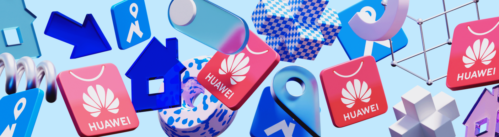

[comment]: # (Markdown formating https://docs.github.com/ru/get-started/writing-on-github/getting-started-with-writing-and-formatting-on-github/basic-writing-and-formatting-syntax)

<p align="center">
  
</p>

<h1 align="center">
    Huawei AppGallery Publishing Gradle Plugin
</h1>

<a href="https://plugins.gradle.org/plugin/ru.cian.huawei-publish-gradle-plugin"></a>
<a href="http://www.apache.org/licenses/LICENSE-2.0.html"></a>

The plugin allows to publish the android release build files (`*.apk` and `*.aab`) to the Huawei AppGallery by use official [Huawei Publish API (v2)](https://developer.huawei.com/consumer/en/doc/AppGallery-connect-References/agcapi-obtain_token-0000001158365043)

:construction: _That's unofficial plugin. We made it for ourselves and are sharing it for you._

# Table of contents
<!-- TOC -->
- [Features](#features)
- [Compatibility](#compatibility)
- [Adding the plugin to your project](#adding-the-plugin-to-your-project)
    - [Using the Gradle plugin DSL](#using-the-gradle-plugin-dsl)
    - [Using the `apply` method](#using-the-apply-method)
    - [Quick Start Plugin Configuration](#quick-start-plugin-configuration)
    - [Full Plugin Configuration](#full-plugin-configuration)
- [Plugin usage](#plugin-usage)
- [CLI Plugin Configuration](#cli-plugin-configuration)
- [Known Huawei Publishing API Issues](#known-huawei-publishing-api-issues)
- [FAQ](#faq)
<!-- /TOC -->

# Features

The following features are available:

- :white_check_mark: Publish APK or AAB build file in Huawei AppGallery
- :white_check_mark: Submit the build to all users after getting store approve
- :white_check_mark: Publish the build to a part of users (Release Phases)
- :white_check_mark: Update Release Notes for publishing build (Release Notes)
- :white_check_mark: Update App Basic Info for publishing build
- :white_check_mark: Separated settings for different configurations build types and flavors
- :white_check_mark: Support of Gradle Portal and Gradle DSL
- :white_check_mark: Support of Gradle 8.+
- :white_check_mark: Support of Configuration Cache

The following features are missing:

- :children_crossing: Change App Store Information: description, app icon, screenshots and etc.

The following features doesn't support Huawei Publishing API:

- :no_entry: Update appname, title and description.
- :no_entry: Rollout Holding

# Compatibility
The Android Gradle Plugin often changes the Variant API,
so a different version of AGP corresponds to a specific version of the current plugin

| Android Gradle Plugin | Huawei Publishing Plugin                                                             |
|-----------------------|--------------------------------------------------------------------------------------|
| 4.0.+                 | 1.2.3                                                                                |
| 4.1.+                 | 1.2.4                                                                                |
| 4.2.+                 | 1.2.6                                                                                |
| 7.+                   | 1.3.8                                                                                |
| 8.+                   | [latest](https://github.com/cianru/huawei-appgallery-publish-gradle-plugin/releases) |

# Adding the plugin to your project

in application module `./app/build.gradle`

## Using the Gradle plugin DSL

```
plugins {
    id("com.android.application")
    id("ru.cian.huawei-publish-gradle-plugin")
}
```

## Using the `apply` method

```groovy
buildscript {
    repositories {
        gradlePluginPortal()
    }

    dependencies {
        classpath "ru.cian.huawei-plugin:plugin:<PLUGIN_VERSION>"
    }
}

apply plugin: 'com.android.application'
apply plugin: 'ru.cian.huawei-publish-gradle-plugin'
```

## Quick Start Plugin Configuration

Before using the plugin you should get `client_id` and `client_secret` from [AppGallery Connect API Getting Started](https://developer.huawei.com/consumer/en/doc/development/AppGallery-connect-Guides/agcapi-getstarted).

Minimal configuration for plugin usage:

<details open>
<summary>Kotlin</summary>

```kotlin
huaweiPublish {
  instances {
      create("release") {
        /**
         * Description: The AppGallery credentials params (`client_id` and `client_secret`) in json format which encoded to Base64.
         * How to get credentials see [AppGallery Connect API Getting Started](https://developer.huawei.com/consumer/en/doc/development/AppGallery-connect-Guides/agcapi-getstarted).
         *
         * Credential json example:
         * {
         *    "client_id": "<CLIENT_ID>",
         *    "client_secret": "<CLIENT_SECRET>"
         * }
         * Base64 encoded value example: "ewogICAgImNsaWVudF9pZCI6ICI8Q0xJRU5UX0lEPiIsCiAgICAiY2xpZW50X3NlY3JldCI6ICI8Q0xJRU5UX1NFQ1JFVD4iCn0="
         *
         * Type: String (Optional)
         * Default value: `null` (but plugin wait that you provide credentials by CLI params)
         * CLI: `--credentials`
         */
        credentials = "<BASE64_ENCODED_CREDENTIALS>"

        /**
         * 'apk' or 'aab' for corresponding build format.
         * Type: String (Optional)
         * Default value: `apk`
         * CLI: `--buildFormat`
         */
          buildFormat = ru.cian.huawei.publish.BuildFormat.APK
      }
  }
}
```
</details>

<details>
<summary>Groovy</summary>

```groovy
huaweiPublish {
  instances {
      release {
          credentialsPath = "$rootDir/huawei-credentials-release.json"
          buildFormat = "apk"
      }
  }
}
```
</details>

## Full Plugin Configuration

<details open>
<summary>Kotlin</summary>

```kotlin
huaweiPublish {
  instances {
      create("release") {
        /**
         * Description: The AppGallery credentials params (`client_id` and `client_secret`) in json format which encoded to Base64.
         * How to get credentials see [AppGallery Connect API Getting Started](https://developer.huawei.com/consumer/en/doc/development/AppGallery-connect-Guides/agcapi-getstarted).
         * Higher priority than `credentialsPath` parameter.
         *
         * Credential json example:
         * {
         *    "client_id": "<CLIENT_ID>",
         *    "client_secret": "<CLIENT_SECRET>"
         * }
         * Base64 encoded value example: "ewogICAgImNsaWVudF9pZCI6ICI8Q0xJRU5UX0lEPiIsCiAgICAiY2xpZW50X3NlY3JldCI6ICI8Q0xJRU5UX1NFQ1JFVD4iCn0="
         *
         * Type: String (Optional)
         * Default value: `null` (but plugin wait that you provide credentials by CLI params)
         * CLI: `--credentials`
         */
        credentials = "<BASE64_ENCODED_CREDENTIALS>"

        /**
         * Description: Path to json file with AppGallery credentials params (`client_id` and `client_secret`).
         * How to get credentials see [AppGallery Connect API Getting Started](https://developer.huawei.com/consumer/en/doc/development/AppGallery-connect-Guides/agcapi-getstarted).
         * Lower priority than `credentials` parameter.
         *
         * Plugin credential json example:
         * {
         *    "client_id": "<CLIENT_ID>",
         *    "client_secret": "<CLIENT_SECRET>"
         * }
         *
         * Type: String (Optional)
         * Default value: `null` (but plugin wait that you provide credentials by CLI params)
         * CLI: `--credentialsPath`
         */
          credentialsPath = "$rootDir/huawei-credentials-release.json"

        /**
         * Deploy type. Available values:
         * Type String (Optional)
         * Default value: `publish`
         * Gradle: available values:
         *      ru.cian.huawei.publish.DeployType.PUBLISH
         *      ru.cian.huawei.publish.DeployType.UPLOAD_ONLY
         *      ru.cian.huawei.publish.DeployType.DRAFT
         * CLI: `--deployType`, available values:
         *      'publish' to deploy and submit build to users;
         *      'draft' to deploy and save as draft without submit to users;
         *      'upload-only' to deploy without draft saving and submit to users;
         */
          deployType = ru.cian.huawei.publish.DeployType.PUBLISH

        /**
         * Description: Build file format.
         * Type: String (Optional)
         * Default value: `apk`
         * Gradle: available values:
         *      ru.cian.huawei.publish.BuildFormat.APK
         *      ru.cian.huawei.publish.BuildFormat.AAB
         * CLI: `--buildFormat`, available values:
         *      'apk' – for APK build format;
         *      'aab' – for AAB build format.
         */
          buildFormat = ru.cian.huawei.publish.BuildFormat.APK

        /**
         * Description: By default, the plugin searches for the assembly file at the standard file path. Use param to change file path.
         * Type: String (Optional)
         * Default value: null
         * CLI: `--buildFile`
         */
          buildFile = "${buildDir}/app/outputs/apk/release/app-release.apk"

        /**
         * The socket timeout for publish requests in seconds.
         * Type: Long (Optional)
         * Default value: `60` // (1min)
         * CLI: `--publishSocketTimeoutInSeconds`
         */
        publishSocketTimeoutInSeconds = 60

        /**
         * API use chunks to upload the build file. So after last file part server needs some time to join and check whole file.
         * This param provide time in millis during which the plugin periodically tries to publish the build.
         * Type: Long (Optional)
         * Default value: `600000` // (10min)
         * CLI: `--publishTimeoutMs`
         */
          publishTimeoutMs = 600_000

        /**
         * API use chunks to upload the build file. So after last file part server needs some time to join and check whole file.
         * This param provide time period in millis between tries to publish the build.
         * Type: Long (Optional)
         * Default value: `15000` // (15sec)
         * CLI: `--publishPeriodMs`
         */
          publishPeriodMs = 15_000

        /**
         * Release time after review in UTC format. The format is 'yyyy-MM-dd'T'HH:mm:ssZZ'.
         * Type: String (Optional)
         * Default value: `null` // (means immediately will be published after store review)
         * CLI: `--releaseTime
         */
          releaseTime = "2025-10-21T06:00:00+0300"

        /**
         * Release Phase settings. For more info see documentation below.
         * Type: ReleasePhase (Optional)
         * Default value: `null` // (means the build will be published immediately to 100% users)
         * CLI: (see ReleasePhase param desc.)
         */
          releasePhase = ru.cian.huawei.publish.ReleasePhaseExtension(
              /**
               * Start release time after review in UTC format. The format is 'yyyy-MM-dd'T'HH:mm:ssZZ'.
               * Type: String (Required)
               * CLI: `--releasePhaseStartTime`
               */
                startTime = "2025-01-18T21:00:00+0300",

              /**
               * End release time after review in UTC format. The format is 'yyyy-MM-dd'T'HH:mm:ssZZ'.
               * Type: String (Required)
               * CLI: `--releasePhaseEndTime`
               */
                endTime = "2025-01-21T06:00:00+0300",

              /**
               * Percentage of target users of release by phase. The integer or decimal value from 0 to 100.
               * Type: String (Required)
               * CLI: `--releasePhasePercent`
               */
                percent = 5.0 // (equals to 5%)
          )

        /**
         * Description: Release Notes settings. For more info see documentation below.
         * Type: ReleaseNotes (Optional)
         * Default value: `null`
         * CLI: (see ReleaseNotes param desc.)
         */
          releaseNotes = ru.cian.huawei.publish.ReleaseNotesExtension(

              /**
               * Release Notes by languages. For more info see documentation below.
               * Type: List<ReleaseNote> (Required)
               * Default value: `null`
               * CLI: (See `--releaseNotes` desc.)
               */
                descriptions = listOf(

                      /**
                       * Release Note list item.
                       */
                      ru.cian.huawei.publish.ReleaseNote(

                          /**
                           * [Langtype value from Huawei Publish API](https://developer.huawei.com/consumer/en/doc/development/AppGallery-connect-References/agcapi-reference-langtype-0000001158245079)
                           * Type: String (Required)
                           * CLI: (See `--releaseNotes` desc.)
                           */
                          lang = "en-US",

                          /**
                           * Absolutely path to file with Release Notes for current `lang`. Release notes text must be less or equals to 500 sign.
                           * Type: String (Required)
                           * CLI: (See `--releaseNotes` desc.)
                           */
                          filePath = "$projectDir/release-notes-en.txt"
                      ),

                      ru.cian.huawei.publish.ReleaseNote(
                                lang = "ru-RU",
                                filePath = "$projectDir/release-notes-ru.txt"
                      ),
                ),

              /**
               * :warning: !!!EXPERIMENTAL!!!
               * True - if needs to remove html tags from provided release notes. For example to support Google Play release notes.
               * Type: Boolean (Optional)
               * Default value: `false`
               * CLI: (See `--removeHtmlTags` desc.)
               */
                removeHtmlTags = false
          )

        /**
         * Description: Path to json file with params to update app basic info [Huawei Publish API](https://developer.huawei.com/consumer/en/doc/development/AppGallery-connect-References/agcapi-app-info-update-0000001111685198))
         * Type: String (Optional)
         * Default value: `null`
         * CLI: `--appBasicInfo`
         */
          appBasicInfo = "$projectDir/app-basic-info.json"
      }
      create("debug") {
          ...
      }
  }
}
```
</details>

<details>
<summary>Groovy</summary>

```groovy
huaweiPublish {
  instances {
      release {
          credentials = "<BASE64_ENCODED_CREDENTIALS>" // Higher priority than `credentialsPath`;
          credentialsPath = "$rootDir/huawei-credentials-release.json" // Lower priority than `credentials`;
          deployType = "publish"
          buildFormat = "apk"
          buildFile = "${buildDir}/app/outputs/apk/release/app-release.apk"
          publishSocketTimeoutInSeconds = 60
          publishTimeoutMs = 600_000
          publishPeriodMs = 15_000
          releaseTime = "2025-10-21T06:00:00+0300"
          releasePhase = new ru.cian.huawei.publish.ReleasePhaseExtension(
              "2021-10-18T21:00:00+0300",
              "2025-10-21T06:00:00+0300",
              5.0
          )
          releaseNotes = new ru.cian.huawei.publish.ReleaseNotesExtension(
              [
                new ru.cian.huawei.publish.ReleaseNote(
                        "en-EN",
                        "$projectDir/release-notes-en.txt"
                ),
                new ru.cian.huawei.publish.ReleaseNote(
                    "ru-RU",
                    "$projectDir/release-notes-ru.txt"
                ),
              ],
              false
          )
          appBasicInfo = "$projectDir/app-basic-info.json"
      }
      debug {
          ...
      }
  }
}
```
</details>

Also the plugin support different buildType and flavors.
So for demo and full flavors and release buildType just change instances like that:
```kotlin
huaweiPublish {
    instances {
        create("release") {
            ...
        }
        create("demoRelease")
            ...
        }
        create("fullRelease")
            ...
        }
    }
}
```

# Plugin usage

Gradle generate `publishHuaweiAppGallery<*>` task for all BuildType and Flavor configurations.

:warning: **Note!** The plugin will publish already existed build file. Before uploading you should build it yourself. Be careful. Don't publish old build file.

```bash
./gradlew assembleRelease publishHuaweiAppGalleryRelease
```

or

```bash
./gradlew bundleRelease publishHuaweiAppGalleryRelease
```

# CLI Plugin Configuration

You can change plugin configuration by CLI. There are all the same parameters as in the plugin gradle configuration.
CLI params are more priority than gradle configuration params.

```bash
./gradlew assembleRelease publishHuaweiAppGalleryRelease \
    --credentials = "<BASE64_ENCODED_CREDENTIALS>" \  # Higher priority than `credentialsPath`;
    --credentialsPath="./sample-kotlin/huawei-credentials.json" \  # Lower priority than `credentials`;
    --deployType=publish \
    --buildFormat=apk \
    --buildFile="./app/outputs/apk/release/app-release.apk"
    --publishSocketTimeoutInSeconds=60 \
    --publishTimeoutMs=600000 \
    --publishPeriodMs=15000 \
    --releaseTime="2025-10-21T06:00:00+0300" \
    --releasePhaseStartTime=2020-11-13T08:01:02+0300 \
    --releasePhaseEndTime=2020-11-20T15:30:00+0300 \
    --releasePhasePercent=5.0 \
    --releaseNotes="en_EN:/home/<USERNAME>/str/project/release_notes_en.txt;ru_RU:/home/<USERNAME>/str/project/release_notes_ru.txt" \
    --appBasicInfo="/sample-kotlin/app-basic-info.json"
```

# Examples

<details>
<summary>Example  uploading build file without publishing</summary>

You can upload the build file as draft without submit to users.

From gradle build script:
```groovy
huaweiPublish {
    instances {
        release {
            credentials = "<BASE64_ENCODED_CREDENTIALS>"
            deployType = "draft"
        }
    }
}
```

or execute from command line:

```bash
./gradlew assembleRelease publishHuaweiAppGalleryRelease \
    --credentials = "<BASE64_ENCODED_CREDENTIALS>" \
    --deployType=draft
```

</details>

<details>
<summary>Example publishing AppBundle</summary>

If you choose AppBundle see [Application Signature](https://developer.huawei.com/consumer/en/service/josp/agc/index.html#/myApp/101338815/9249519184596012000) before using the plugin.

From gradle build script:
```groovy
huaweiPublish {
    instances {
        release {
            credentials = "<BASE64_ENCODED_CREDENTIALS>"
            buildFormat = "aab"
        }
    }
}
```
or execute from command line:

```bash
./gradlew assembleRelease publishHuaweiAppGalleryRelease \
    --credentials = "<BASE64_ENCODED_CREDENTIALS>" \
    --buildFormat=aab
```

After uploading build file the Huawei Service will start processed. It may take 2-5 minutes, depending on the size of the software package.
While publishing the AppBundle build file you can get the error:
>What went wrong:
> Execution failed for task ':app:publishHuaweiAppGalleryRelease'.
> Ret(msg=[cds]submit failed, additional msg is [The file is being processed.
> It may take 2-5 minutes, depending on the size of the software package.])

When publishing an AppBundle the service takes some time to parse the file.
In this case, the plugin uses a special mechanism for the full cycle.
By default, the plugin tries to publish the assembly every 15 seconds for 10 minutes.
To change values see using parameters: `publishTimeoutMs` and `publishPeriodMs`.

For more information see the [Issue#7](https://github.com/cianru/huawei-publish-gradle-plugin/issues/7)
and [Issue#38](https://github.com/cianru/huawei-publish-gradle-plugin/issues/38).

</details>

<details>
<summary>Example publishing with release phase</summary>

You can upload the build file and submit it to the part of users.

From gradle build script:
```kotlin
huaweiPublish {
    instances {
        release {
            credentials = "<BASE64_ENCODED_CREDENTIALS>"
            releasePhase {
                startTime = "2020-11-13T08:01:02+0300"
                endTime = "2020-11-20T15:30:00+0300"
                percent = 10.0
            }
        }
    }
}
```

or execute from command line:

```bash
./gradlew assembleRelease publishHuaweiAppGalleryRelease \
    --credentials = "<BASE64_ENCODED_CREDENTIALS>" \
    --releasePhaseStartTime=2020-11-13T08:01:02+0300 \
    --releasePhaseEndTime=2020-11-20T15:30:00+0300 \
    --releasePhasePercent=10.0
```

While publishing with release phase you can get the error:
>Execution failed for task ':app:publishHuaweiAppGalleryRelease'.
>Update App File Info is failed. Response: UpdateAppFileInfoResponse(ret=Ret(code=204144644, msg=[AppGalleryConnectPublishService]call cds to query app information failed))

I asked Huawei support. They confirmed the server issue. To work around this problem you should once set
the release phase for uploader build from Developer Console. After that plugin should publish next builds without this error.
(Sorry for RU screenshot interface locale. Huawei doesn't allow me to change it to EN)


One more note. If already there is published version that waiting for review you'll get error:

>What went wrong:
>Execution failed for task ':app:publishHuaweiAppGalleryRelease'.
>Update App File Info is failed. Response: UpdateAppFileInfoResponse(ret=Ret(code=204144647, msg=[cds]update service failed, additional msg is [The new service has can't be edited service,which can't be updated!]))

For more information see the [Issue#10](https://github.com/cianru/huawei-publish-gradle-plugin/issues/10)

</details>

# Known Huawei Publishing API Issues

List of known problems and solutions with the plugin and Huawei AppGallery API that users of the plugin have encountered:

* I use correct `client_id` and `client_secret` but get [Huawei AppGallery Connect API - 403 client token authorization fail](https://stackoverflow.com/questions/63999681/huawei-appgallery-connect-api-403-client-token-authorization-fail)
* There is no way to publish build to open testing track in AppGallery. See [issues/34](https://github.com/cianru/huawei-publish-gradle-plugin/issues/34)
* You can't upload and publish the same version twice if you publish with submission to users the first time. The second time you will get the error:
```bash
Task :app:publishHuaweiAppGalleryRelease FAILED

Execution failed for task ':app:publishHuaweiAppGalleryRelease'.
> Update App File Info is failed. Response: UpdateAppFileInfoResponse(ret=Ret(code=204144647, msg=[cds]update service failed, additional msg is [The new service has can't be edited service,which can't be updated!]))
```
* Huawei Developer Console doesn't save list of countries from previous release. To fix that just use `appBasicInfo` param with json `{"publishCountry": "BY,MD,RU,AM,AZ,GE,KZ,KG,MN,TJ,TM,UZ"}`. For more info see parameter description and [issue/41](https://github.com/cianru/huawei-appgallery-publish-gradle-plugin/issues/41).

# FAQ
<details>
<summary>Support the same [Triple-T](https://github.com/Triple-T/gradle-play-publisher) Release Notes catalogs structure.</summary>

___

It's a bad idea to use the same file structure from third-party project
because my plugin will be strongly depended on however my project even doesn't
use it directly. If the `Triple-T` will change catalogs or files structure
it leads to a bug into my plugin.

Instead of I created a flexible settings for my Release Notes params.
You can reuse the release notes files of Triple project.
See `removeHtmlTags` param description to remove html tags from Google Play release notes.
For example:
```groovy
huaweiPublish {
    instances {
        release {
            releaseNotes = new ru.cian.huawei.publish.ReleaseNotesExtension(
                [
                    new ru.cian.huawei.publish.ReleaseNote(
                            "en-En",
                            "$projectDir/src/main/play/release-notes/en-En/default.txt"
                    ),
                    new ru.cian.huawei.publish.ReleaseNote(
                            "ru-RU",
                            "$projectDir/src/main/play/release-notes/ru-RU/default.txt"
                    ),
                    new ru.cian.huawei.publish.ReleaseNote(
                            "de-DE",
                            "$projectDir/src/main/play/release-notes/de-DE/default.txt"
                    ),
                    new ru.cian.huawei.publish.ReleaseNote(
                            "tr-TR",
                            "$projectDir/src/main/play/release-notes/tr-TR/default.txt"
                    ),
                    new ru.cian.huawei.publish.ReleaseNote(
                            "pt-BR",
                            "$projectDir/src/main/play/release-notes/pt-BR/default.txt"
                    ),
                ],
                true
            )
        }
    }
}
```

In addition, Google and Huawei use different country codes.
To quickly compare them, you can use a little trick
that [@rtsisyk](https://github.com/rtsisyk) came up with

```groovy
huaweiPublish {
  instances {
    huaweiRelease {
      credentialsPath = "$rootDir/huawei-appgallery.json"
      buildFormat = 'aab'
      deployType = 'draft' // confirm manually
      releaseDescriptions = []
      def localeOverride = [
          'am' : 'am-ET',
          'gu': 'gu_IN',
          'iw-IL': 'he_IL',
          'kn-IN': 'kn_IN',
          'ml-IN': 'ml_IN',
          'mn-MN': 'mn_MN',
          'mr-IN': 'mr_IN',
          'ta-IN': 'ta_IN',
          'te-IN': 'te_IN',
      ]
      def files = fileTree(dir: "$projectDir/src/google/play/release-notes",
          include: '**/default.txt')
      files.each { File file ->
        def path = file.getPath()
        def locale = file.parentFile.getName()
        locale = localeOverride.get(locale, locale)
        releaseDescriptions.add(new ru.cian.huawei.publish.ReleaseNote(locale, path))
      }
      releaseNotes = new ru.cian.huawei.publish.ReleaseNotesExtension(releaseDescriptions)
    }
  }
}
```
___
</details>

# License

```
Copyright 2020 Aleksandr Mirko

Licensed under the Apache License, Version 2.0 (the "License");
you may not use this file except in compliance with the License.
You may obtain a copy of the License at

   http://www.apache.org/licenses/LICENSE-2.0

Unless required by applicable law or agreed to in writing, software
distributed under the License is distributed on an "AS IS" BASIS,
WITHOUT WARRANTIES OR CONDITIONS OF ANY KIND, either express or implied.
See the License for the specific language governing permissions and
limitations under the License.
```
